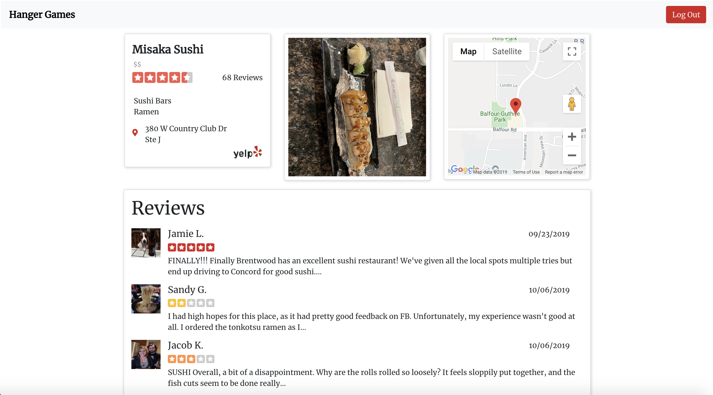

# Hanger Games

Hanger Games is a web application that will help with everyday decision making. Powered by Yelp's Fusion API, it uses a users location and search preferences to help decide where to eat.

# Screenshots:

 

# Technologies Used
* React
* CSS
* Javascript
* Express
* MongoDB
* Yelp Fusion API
* Google Maps API

# Getting Started

* Does not require sign in to search nearby restaurants.
* Signing up will allow users to save search preferences.
* Restuarant details are minimal and have links to the original yelp post.
* Responsive for mobile.

[Click here!](https://hangrygames.herokuapp.com)

# Next Steps
* Move search bar inside navbar.
* Additional user profile preferences.
* Search by map.
* Dark mode.